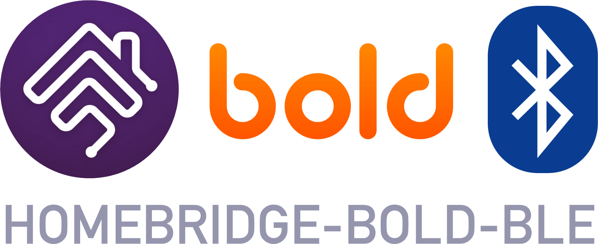

<p align="center">
    
</p>

<span align="center">

# Homebridge Bold BLE

[](https://www.npmjs.com/package/homebridge-bold-ble)
[](https://www.npmjs.com/package/homebridge-bold-ble)
<br/>
[](https://github.com/robbertkl/homebridge-bold-ble/issues)
[](https://github.com/robbertkl/homebridge-bold-ble/pulls)

</span>

## Introduction

Homebridge Bold BLE is a Homebridge plugin to provide HomeKit support for [Bold Smart Cylinder](https://boldsmartlock.com) locks. This plugin is similar to the great [homebridge-bold](https://github.com/StefanNienhuis/homebridge-bold) plugin, but instead controls your smart locks through a direct Bluetooth (BLE) connection.

Some key features / differences:

- Instead of using remote activation through Bold's API server, Homebridge Bold BLE connects directly to your smart lock to control it.
- This means that for this plugin **no Bold Connect hub is required**! You can even use HomeKit to perform remote activation for your locks, provided you have a device acting as a home hub (e.g. Apple TV or HomePod).
- Your Homebridge device (e.g. Raspberry Pi running Homebridge) needs to be within Bluetooth range of the Bold locks you wish to control.
- No internet connection is required at the moment of unlocking. This also makes the unlock a bit quicker, since it avoids a roundtrip to the Bold API when unlocking.
- This plugin is not completely offline, though: it still has to pull fresh keys from the Bold API every 3-4 days. This is done automatically in the background to make sure an unlock request through HomeKit can always be handled quickly and offline.
- Bold locks in your account / that you have access to are automatically added. However, only Bold locks that are actually within Bluetooth range are exposed to HomeKit.

## Installation

To install Homebridge Bold BLE:

- Follow the instructions on the [Homebridge Wiki](https://github.com/homebridge/homebridge/wiki) to install Node.js and Homebridge.
- Depending on your OS, you might need to [install a few Bluetooth-related packages](https://github.com/noble/noble#prerequisites); however, for the official Homebridge Raspberry Pi image, the plugin works out of the box without any additional packages.
- Install the Homebridge Bold BLE plugin through Homebridge Config UI X or manually by:
  ```
  sudo npm install --global homebridge-bold-ble
  ```
- Run through the login flow within Homebridge Config UI X (recommended!) or see [Configuration](#configuration) for other options.

## Configuration

It is recommended to use Homebridge Config UI X to configure the plugin. A login flow is provided to obtain the required access tokens.

Alternatively, you can manually configure the plugin with tokens you've obtained in a different way.

The configuration is identical to the [homebridge-bold](https://github.com/StefanNienhuis/homebridge-bold) plugin, so please see [its configuration documentation](https://github.com/StefanNienhuis/homebridge-bold#configuration) for more info. Just make sure to use `"BoldBLE"` instead of `"Bold"` for the `platform` property.

There are 3 ways to authenticate:

- _Default authentication_ using [@StefanNienhuis](https://github.com/StefanNienhuis)'s hosted authentication server.
- _Default authentication_ with your own hosted authentication server; requires your own OAuth client ID and secret from Bold.
- _Legacy authentication_; not recommended: it will sign you out of your Bold app, because it supports only 1 active session.

For simplicity, the login flow provided with this plugin only performs the first, recommended way. For the alternative ways, you could: install [homebridge-bold](https://github.com/StefanNienhuis/homebridge-bold), go through the desired authentication flow, and finally copy the resulting tokens into your Homebridge Bold BLE configuration.

## Authors

- Robbert Klarenbeek, <robbertkl@renbeek.nl>

## Credits

Thanks to [@StefanNienhuis](https://github.com/StefanNienhuis) for creating the original [homebridge-bold](https://github.com/StefanNienhuis/homebridge-bold) plugin and hosting the authentication server that this plugin uses.

If you're considering buying a Bold Smart Lock, get a 10% discount and support [@StefanNienhuis](https://github.com/StefanNienhuis) by using the referral code: [STENIE1](https://boldsmartlock.com/?referral-code=STENIE1).

## License

Homebridge Bold BLE is published under the [MIT License](http://www.opensource.org/licenses/mit-license.php).
